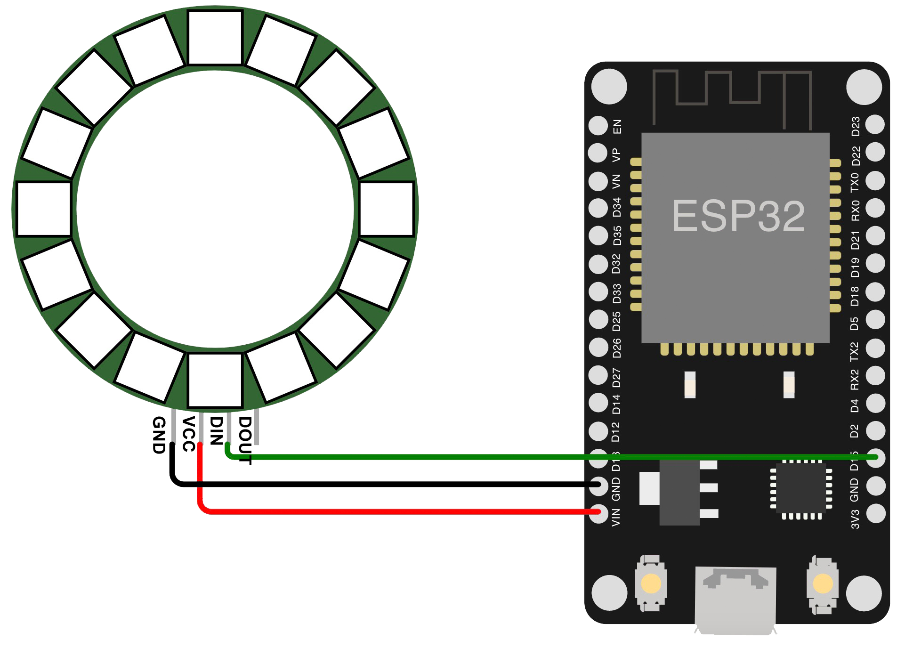

# Segenszustand der Welt
Die Lampe zeigt den Segenszustand der Welt.<br />
Wir glauben, dass Sie dabei helfen kann aufmerksam zu werden für die guten Nachrichten die viel zu häufig keine Beachtung finden. Dabei bleibt es den Nutzer:innen verschlossen welche Nachrichten auf welche Weise bewertet wurde. Lediglich die Farbe gibt einen Hinweis auf den aktuellen Zustand. Es ist den Nutzer:innen freigestellt selber nach Nachrichten zu suchen oder nicht. Die Lampe ist als ein andauernder Begleiter konzipiert.<br />
Segen wird so sichtbar ohne explizit zu machen wann, wo und wie etwas Gutes oder Schlechtes passiert ist.

## Funktionsweise
Die Lampe ruft via [NewsAPI.org](newsapi.org) die neusten *Schlagzeile* aus Deutschland hab. [NewsAPI.org](newsapi.org) greift dabei insgesamt auf mehr als 50 Webseiten zu und ließt nie aktuellste *Schlagzeile* jeder Seite aus. Die erste *25 Schlagzeilen* werden mittels Sentimentanalyse via [meaningcloud.com](https://www.meaningcloud.com/developer/sentiment-analysis) bewertet. Den *Schlagzeilen* werden dabei die Werte von -2, -1, 0, 1, 2 zugewiesen. Diese Werte werden miteinander addiert und so der aktuelle Wert für den Segenszustand der Welt berechnet. Der so errechnete Wert wird via 7er oder 11er Farbskala an den LED Ring ausgegeben. Dieser Vorgang wiederholt sich alle 30 Minuten. <br />
Um den Segenszustand der Welt als Statistik ausgegeben zu können wird der Wert via MQTT ausgegeben. Dazu muss ein MQTT Broker (https://mosquitto.org/) im Netzwerk verfügbar sein. Dieser Wert kann dann via Home Assistant(https://www.home-assistant.io/) ausgegeben werden.<br />
Um die *Schlagzeilen* und den Vorgang der Bewertung einsehen zu können sind die Log Dateien via [WebSerial](https://www.arduino.cc/reference/en/libraries/webserial/) im Browser auslesbar. Auslesen ist nur möglich im Moment der Datenabfrage.

# Installation
## Skripte
Es sind vier Skripte für die Lampe mit unterschiedlichem Funktionsumfang vorhanden:
1. [Lampe inkl. MQTT und Webserial](/lampe-mqtt-webserial.ino)
2. [Lampe inkl. Webserial](/lampe-webserial.ino)
3. [Lampe inkl. MQTT](/lampe-mqtt.ino)
4. [Lampe](/lampe.ino)

## Hardware
* ESP32
* NeoPixel Ring
* Mini USB Kabel und Stecker

## Schaltplan


## Zusammenbau der Hardware
* Verbinden Sie den NeoPixel Ring mit dem ESP32 Board.
	* Sofern notwendig löten Sie die Kabel auf die Platine des NeoPixel Ring.
* Merken Sie sich den GPIO Pin Nummer an den Sie den NeoPixel angeschlossen haben.
* Schließen Sie den 5V Anschluss an VIN an.
* Schließen Sie GND an GND an.
* Sofern Sie nichts am Code ändern wollen schließen Sie den DI anschluss an GPIO 15 an. Direkt neben VIN und GND. Sie können auch jeden anderen Pin verwenden.

## Installation der Software
*  Arduino IDE installieren
*  Für die Installation wird [Arduino IDE](https://www.arduino.cc/en/software) benötigt. Lande Sie sich die passende Version für Ihr Betriebssytem herunter und installieren Sie die Software.
* Verbinden Sie das ESP32 Board via USB mit Ihrem Computer
* Starten Sie die Arduino IDE
* Wählen Sie das Board aus. Für ein ESP32 Board nutzen Sie FireBeetle-ESP32 als Konfiguration.
	* Dazu klicken Sie oben in der Leiste auf die Auswahlbox und wählen: `Select other board an port...`
	* In dem sich öffnenden Menü suchen Sie im Bereich Boards nach FireBeetke-ESP32.
	* Im Bereich Ports wählen Sie das angeschlossene Board aus.
	* Bestätigen Sie mit OK.
* Das Board ist nun mit Arduino IDE verbunden.
* Löschen Sie alles was aktuell im Skript steht.
* Kopieren Sie den Inhalt des von ihnen gewünschten Skriptes von GitHub und fügen es ein.
	* Passen Sie das Skript an:
		* WLAN (notwendig)
		* NewsAPI und Meaningcloud API Keys (notwendig)
		* LED Anzahl anpassen (notwendig)
		* MQTT (wenn gewünscht)
* Drücken Sie oben links auf Upload
* Damit der Upload startet halten Sie am ESP32 Board den Knopf `boot` gedrückt bis der Vorgang auf dem Rechner startet.
* Wenn der Upload erfolgreich war startet der Vorgang der Analyse.
	* Diesen können Sie im unteren Drittel unter dem Reiter `Serial Log` einsehen.

## Option: MQTT
Folgende Informationen werden an MQTT geschickt und können angepasst werden.

```
{
  "name": "Zustand der Welt",
  "state_topic": "Moodlicht/zustandderwelt",
  "force_update": true,
  "availability_topic": "Moodlicht/status",
  "payload_available": "online",
  "payload_not_available": "offline",
  "unique_id": "moodlicht1",
  "device": {
    "manufacturer": "Simon Luthe",
    "model": "Moodlicht",
    "connections": [
      [
        "mac",
        "7C9EBD371680"
      ]
    ]
  }
}
```

Diese Topic muss in JSON Format serialisiert werden. Das kann über diese Seite geschehen.

https://arduinojson.org/v6/assistant/#/step1

- Im ersten Schritt muss Prozessor, Mode und Output type definiert werden.
	- `ESP32`
	- `Serialize`
	- `char[N]`

- Im zweiten Schritt muss die angepasste Information eingefügt werden.
- Im dritten Schritt wird die erforderliche Größe der Nachricht in bytes angegeben. Dieser Wert ist notwendig und beträgt bei der vorgeschlagene Nachricht 384.
- Im vierten Schritt wird der Programmcode für die MQTT Nachricht ausgegeben und kann an der richtigen Stelle im Dokument eingefügt werden.


## Option: WebSerial
Mittels IP-Adresse kann die Webansicht der Analyse aufgerufen werden.
